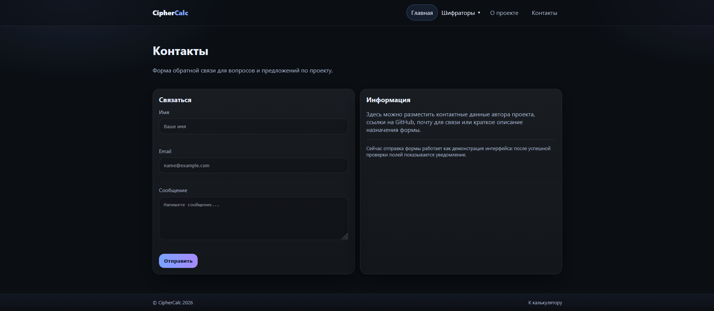
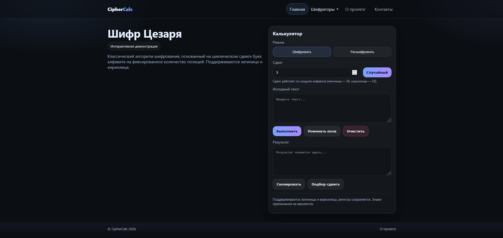
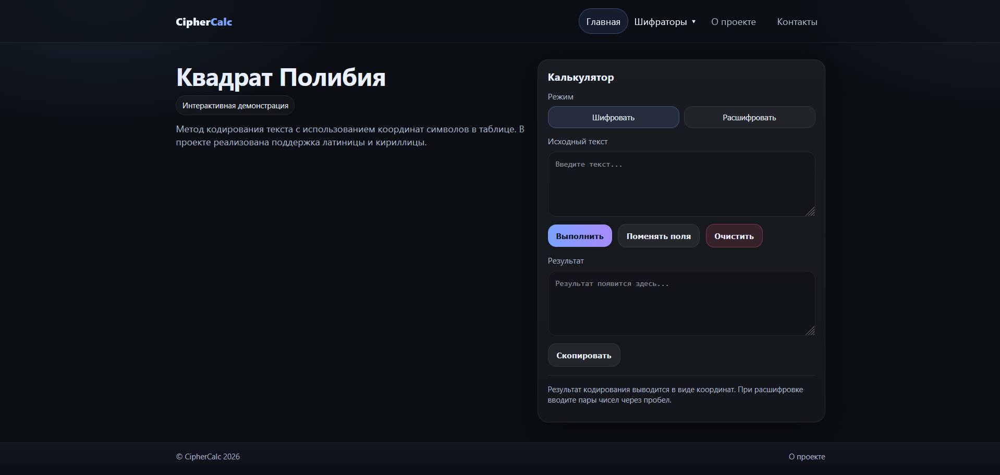
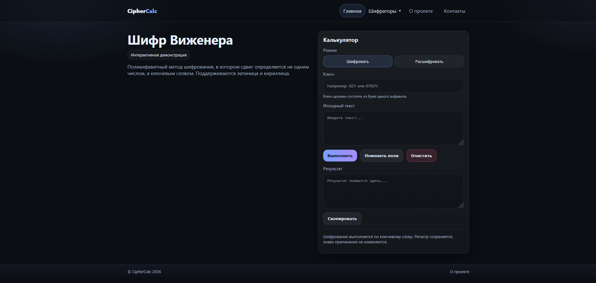
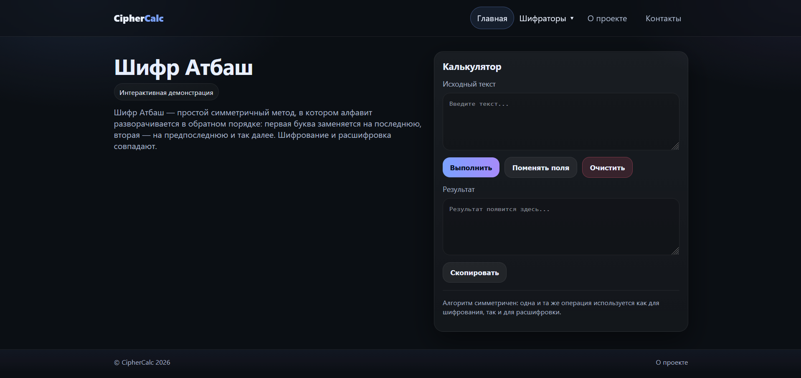

# CipherCalc

Live Demo: https://amadene12-art.github.io/ciphercalc/

CipherCalc is a web application for working with classical encryption algorithms.
The project demonstrates cryptographic concepts through a simple and interactive interface.

---

## Features

* Text encryption and decryption
* Support for Latin and Cyrillic alphabets (including "ё")
* Case preservation
* Multiple algorithms:

  * Caesar cipher
  * Polybius square
  * Vigenère cipher
  * Atbash cipher
* Caesar bruteforce (shift analysis)
* User-friendly interface:

  * toast notifications
  * responsive layout
  * dropdown navigation
  * mode switching

---

## Implementation Details

* Pure JavaScript (no libraries)
* Universal text handling:

  * Latin → 26 characters
  * Cyrillic → 33 characters
* Shift normalization using modulo
* Supports mixed text (EN + RU)

---

## Tech Stack

* HTML5
* CSS3 (custom properties, responsive design)
* JavaScript (Vanilla JS)

---

## 📂 Project Structure

```
index.html        — main page
caesar.html       — Caesar cipher
polybius.html     — Polybius square
vigenere.html     — Vigenère cipher
atbash.html       — Atbash cipher
about.html        — project info
contact.html      — contact form
style.css         — styles
js-app.js         — application logic
```

---

## Usage

1. Select an algorithm
2. Enter text
3. Set parameters (shift or key)
4. Get instant result

---

## 📸 Screenshots







---

## ⚙️ Getting Started

No build required.

Simply open `index.html` in your browser.

---

## 📌 Future Improvements

* Automatic language detection
* Frequency analysis for Caesar cipher
* Operation history
* More encryption algorithms

---

## 👤 Author

Ivan Bakaldin 
Frontend Developer | Applied Informatics Student
